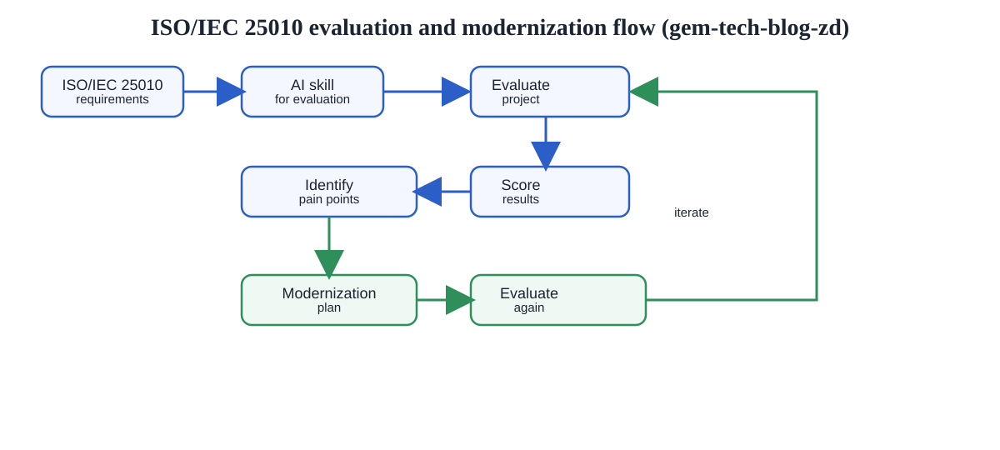

# Modernizing Legacy Software with ISO/IEC 25010 and AI  

## 1. Introduction

Software quality is difficult to assess without a clear framework. For many teams, especially those working with older systems, quality problems remain hidden behind urgent bug fixes, tactical patches, and years of feature-driven development. Over time, redundant code, outdated dependencies, missing tests, and legacy technologies can accumulate until the system becomes harder to evolve and harder to trust.

This is where ISO/IEC 25010 becomes useful. It is a standard published by the International Organization for Standardization (ISO) and belongs to the broader ISO/IEC 25000 SQuaRE family. It gives teams a structured way to evaluate software quality and to discuss software quality in a common, objective language.

The value becomes even stronger when we combine the standard with AI. Instead of relying solely on manual review, we can create reusable evaluation skills and prompts that assess a project consistently. This allows us to generate an initial quality score, identify the main pain points, and turn that into a modernization plan.

In short, the 2023 edition is the more current reference for modern software, while the 2011 edition remains valuable for continuity and historical comparison. For teams evaluating new or modernized systems, the 2023 version is usually the better choice.

## 2. What ISO/IEC 25010 is and what it does

ISO/IEC 25010 is a quality model. It does not prescribe specific implementation patterns or force a single technology stack. Instead, it defines dimensions of software quality that organizations can use to assess products and systems in a structured way.

The most common quality characteristics include:

- Functional suitability
- Performance efficiency
- Compatibility
- Usability
- Reliability
- Security
- Maintainability
- Portability

It also includes quality in use characteristics such as:

- Effectiveness
- Efficiency
- Satisfaction
- Freedom from risk
- Context coverage

This structure is important because software quality is not only about whether the code compiles or the system runs. It is also about whether the system meets user needs, behaves safely in production, remains maintainable, and can evolve over time.

## 3. AI support for evaluation based on ISO/IEC 25010

With AI, the evaluation process becomes much faster and easier to repeat. Instead of manually reviewing large codebases in an ad hoc way, a team can define a reusable evaluation skill that follows the ISO/IEC 25010 model.

### 3.1. A typical AI-based evaluation workflow looks like this:

1. Create a reusable evaluation skill for the project or project family.
2. Provide a prompt that asks the AI to assess the project using ISO/IEC 25010.
3. Collect evidence from requirements, code, tests, architecture, deployments, monitoring, and user feedback.
4. Score each quality characteristic from 1 to 5.
5. Identify weaknesses, missing evidence, and the main risks.
6. Produce a prioritized modernization plan and a follow-up evaluation strategy.

In my approch, each requirement in ISO/IEC 25010 is represented by a dedicated skill. This skill acts as a bridge between the abstract quality model and the concrete project context. The AI can then apply the same assessment logic consistently across different projects, libraries, and components, which improves comparability and makes reuse much easier. 

### 3.2. An example skill 

Let's take a look on the requirement “Maintainability Reviewer Assess analyzability, modifiability, stability, testability, and reusability. Review architecture, code structure, tests, and technical debt. Identify changes that are hard or risky to make.”, my skill for this requirement is shown below:
> "ISO25010-Maintainability
> 
> **Purpose:** Evidence-based assessment of a project's maintainability according to ISO/IEC 25010.
> Act as a senior software quality assessor according to ISO/IEC 25010. Evaluate only the maintainability of this project.
>
> Focus:
> - Analyzability
> - Changeability
> - Modularity
> - Reusability
> - Testability
> - Technical debt
> In particular, assess:
> - Architecture and responsibilities
> - Code structure and coupling
> - Duplication and reuse
> - Tests, test coverage, and testability
> - Documentation and understandability
> - Dependency management and update capability
> - Complexity, hotspots, and maintenance risks
>
> Use only reliable evidence from code, architecture, documentation, CI/CD, tests, build configuration, dependencies, and known runtime/operational artifacts. Strictly separate observations, derived risks, and recommendations. Do not invent project details; if evidence is missing, state this explicitly and mark the assessment as provisional.
>
> Assessment rules:
> - Assign a score from 1–5
> - Describe strengths and weaknesses
> - Provide concrete evidence for each statement
> - Derive technical debt only from verifiable indicators
> - Make modernization recommendations that are prioritized and actionable
>
> Output format:
> 1. Executive summary
>    - Overall maintainability assessment
>    - Maintenance risk: low / medium / high
>    - Main justification
>
> 2. Assessment by sub-characteristic
     >    For each of the six sub-characteristics:
>    - Score
>    - Status: strong / medium / weak
>    - Evidence
>    - Risks
>    - Measures
>
> 3. Technical debt
>    - Recognizable debt drivers
>    - Affected areas
>    - Estimated modernization pressure
>
> 4. Prioritized recommendations
>    - Top 5 measures
>    - Expected benefit
>    - Priority
>
> 5. Conclusion
>    - Confidence level of the assessment
>    - Whether the project appears more modern, stable, or legacy
>
> Additional rules:
> - No blanket statements without evidence
> - No mixing of observation and evaluation
> - Do not overrate individual metrics without context
> - If context is missing, explicitly mark the uncertainty
> 
> **Short form:** structured, traceable, evidence-based, with clear prioritization.
> 
> **File output:** After the assessment is complete, Write the complete result unchanged in a Markdown file named `ISO25010-Maintainability-Evaluation-<ProjectName>-<DD.MM.YYYY-HH-MM>.md`.

This is valuable because it creates a stable evaluation method that can be reused across similar projects. The same skill can be used for different services, libraries, or project components, making assessments more consistent and easier to compare.

### 3.3. Scoring a software system 

After an AI-assisted evaluation, the project receives a score for each quality characteristic, a clear list of the main weaknesses, and a prioritized modernization plan. The plan can then be executed in a controlled manner, and the system can be re-evaluated to verify that the modernization work has measurably improved software quality.

Scoring rubric Use:
*	5 = Excellent / fully compliant / strong evidence
*	4 = Good / minor gaps
*	3 = Acceptable / moderate gaps
*	2 = Weak / significant issues
*	1 = Poor / major nonconformance
*	N/A = Not applicable or no evidence available

### 3.4. An example of evaluation result using skill for maintability looks as below:

> **ISO25010 Maintainability -ProjectName--28.08.2026-11-10**
>
> ### Kurzfazit
> - Gesamtbewertung der Wartbarkeit: mittel
> - Wartungsrisiko: mittel
> - wichtigste Begründung: Das Projekt ist klar strukturiert, gut getestet und auf Java 17/Spring Boot aufgebaut. Schwachpunkte liegen in der Zentralisierung fachlicher Logik in `Processor.java` und der fehlenden technischen Debt-Strategie.
>
> ### Bewertung nach Untermerkmalen
> #### Analysierbarkeit — Score 3, Status mittel
> - Evidenz: `README.md` und Klassen wie `AppController`, `UserService`, `Processor`, `Parser` zeigen klare Verantwortlichkeiten.
> - Risiken: XML-/Schema-Regeln sind fachlich dicht und teilweise in wenigen Klassen konzentriert.
> - Maßnahmen: Kritische Regeln dokumentieren und als eigene Konzepte auslagern.
>
> #### Änderbarkeit — Score 3, Status mittel
> - Evidenz: `pom.xml` nutzt Spring Boot 3.4.13, Java 17, JaCoCo, Spotless; viele Tests existieren.
> - Risiken: `Processor.java` kombiniert XML-Erkennung, Filterung, Parsing, Validierung und CSV-Export.
> - Maßnahmen: Verarbeitung in Services und Adapter aufteilen.
>
> #### Modularität — Score 3, Status mittel
> - Evidenz: Layerstruktur (`app`, `process`, `utils`, `model`) ist vorhanden.
> - Risiken: Geschäftslogik und I/O sind nicht vollständig getrennt.
> - Maßnahmen: Interfaces für Parser-/Export-/Validation-Services einführen.
>
> #### Testbarkeit — Score 4, Status stark
> - Evidenz: Erfolgreicher Maven-Testlauf; JUnit 5, Testcontainers, JaCoCo und viele Unit-/Integrations-Tests sind im Repository sichtbar.
> - Risiken: Einige Tests sind stark auf konkrete Dateien und Pfade fixiert.
> - Maßnahmen: Testmatrix für XML-Varianten ergänzen.
>
> #### Technische Schuld — Score 3, Status mittel
> - Evidenz: `Processor.java` weist Anzeichen für lange, fachlich dichte Methoden und mehrere Verantwortlichkeiten auf.
> - Risiken: Erweiterungen an XML-/Schema-Regeln erhöhen das Änderungsrisiko.
> - Maßnahmen: Refactoring-Roadmap und Hotspot-Review priorisieren.
>
> ### Technische Schuld
> - Schuldtreiber: XML-/Schema-Logik, lokale Pfadbehandlung, zentrale CSV-Exportlogik
> - betroffene Bereiche: `Processor.java`, `Parser.java`, `UserService.java`
> - geschätzter Modernisierungsdruck: mittel
>
> ### Priorisierte Empfehlungen
> 1. `Processor.java` in kleinere Services aufteilen (hoch)
> 2. kritische XML-Regeln mit Testmatrix absichern (hoch)
> 3. CI-Checks für Refactoring/Codequalität konsolidieren (mittel)
> 4. Domain-/Fehlerhierarchien vereinfachen (mittel)
> 5. Architektur-Doku für Export-Workflow ergänzen (mittel)
>
> ### Abschluss
> - Confidence-Level: mittel
> - Bewertung: Das Projekt ist gut getestet und nachvollziehbar, aber die fachliche Kernlogik weist genug Legacy-Charakter auf, um gezielte Modernisierung zu erfordern.

Ten skills are created to cover the main quality characteristics defined in ISO/IEC 25010. These skills are stored in a shared repository and committed to GitLab so they can be reused across projects. Because they are generic and technology-neutral, they can be applied to different software projects and adapted to specific project contexts as needed.
The evaluation skill set is designed to be reusable, neutral, and project-independent. It does not encode a specific application domain or technology stack, which makes it suitable for many software systems and helps ensure consistent, repeatable assessments over time.

## 4. Generation of AI skills and system analysis

A reusable skill is helpful because it turns evaluation into a repeatable process. It standardizes the criteria and improves comparability. Instead of each review depending on the reviewer’s background or memory, the AI applies the same logic across projects.

This is especially useful for large systems that are made up of many subprojects and internal libraries. In such environments, a project may appear stable from the outside while still containing multiple hidden quality problems. The AI can help reveal those hidden issues by systematically checking:

- test coverage and test quality
- dependency age and security exposure
- maintainability and redundancy
- architecture maturity and modularity
- user-facing quality and operational stability

The result is a score-based quality assessment, not only a generic opinion. This gives technical leadership something concrete to work with: a prioritized list of pain points and a measurable baseline.

## 5. Experience: Modernization of a large legacy software system in the Smart Card team

The need for this kind of evaluation becomes very clear in legacy systems. In many organizations, older software systems continue operating for years, extended by many patches, bug fixes, and incremental features. The system still delivers business value, but it no longer has a coherent modernization strategy.

In our case, the system consisted of three active projects and more than ten internal libraries developed over the past decade. It was built on older technology and evolved continuously through many extensions and fixes. There was no consistent modernization effort across the whole platform. As a result, the system accumulated:

- redundant code
- weak or incomplete test coverage
- outdated dependencies
- old technologies no longer supported by the ecosystem
- known security vulnerabilities caused by old libraries
- increasing maintenance complexity

From the outside, the system still worked. But from a quality perspective, it was far from healthy.

This is exactly where ISO/IEC 25010 becomes valuable. It helped us move from an informal, intuition-based discussion to a structured quality assessment. We could identify which characteristics were weak and where the biggest risks were. The evaluation helped us see the real pain points: maintainability, security, dependency health, and long-term evolvability.

With the help of AI, we could run this assessment faster and more consistently. A reusable AI skill based on ISO/IEC 25010 evaluated each project and library, reviewed architecture, tests, dependencies, deployment, and operational evidence, and produced a score for each quality characteristic. This provided a common language for engineers and management alike.

The next step was not a large reimplementation. Instead, we focused on the main pain points. We replaced outdated technology with modern alternatives, reduced redundant logic, improved test coverage, updated dependencies, and addressed the most critical security exposures. The goal was not to rewrite everything at once, but to improve the core weaknesses with minimum disruption to ongoing delivery.

After this modernization effort, we evaluated the system again using the same ISO/IEC 25010-based skill. The score improved substantially. This was important because it showed not only that the code had been cleaned up, but that the modernization work had actually improved system quality in a measurable way.

The result was a system with new life: better maintainability, better security posture, cleaner dependencies, stronger tests, and clearer room for future development. Most importantly, this happened without interrupting delivery to end users.

## 6. Why this approach is valuable

This approach is useful because it combines standards, AI, and practical modernization work in a disciplined loop:

1. Evaluate the current system.
2. Identify the main quality gaps.
3. Plan targeted modernization work.
4. Replace old technology and clean up the pain points.
5. Re-evaluate the system.
6. Repeat the process for the next priority topic.

This is a much safer and more effective path than trying to modernize everything at once or making changes based only on gut feeling. With AI and ISO/IEC 25010, we can move faster, identify the real issues, and create a modernization roadmap that is grounded in evidence.

### Evaluation and modernization flow

## 7. Conclusion

ISO/IEC 25010 provides a strong foundation for evaluating software quality in a structured and objective way. The 2011 edition remains important as a classic reference, while the 2023 edition is increasingly relevant for modern systems and current engineering practice.

When combined with AI, the standard becomes much more actionable. A reusable skill can evaluate an old software system quickly, score each quality characteristic, identify the major pain points, and help shape a realistic modernization plan. This is especially valuable for large legacy systems where the challenge is not only technical debt, but also the risk of continuing to evolve without a clear view of the system’s actual health.

In practice, the benefit is significant: we can evaluate early, focus on the biggest gaps, modernize in controlled steps, and then evaluate again to confirm real improvement. That is how an old system can regain momentum without interrupting business delivery.
